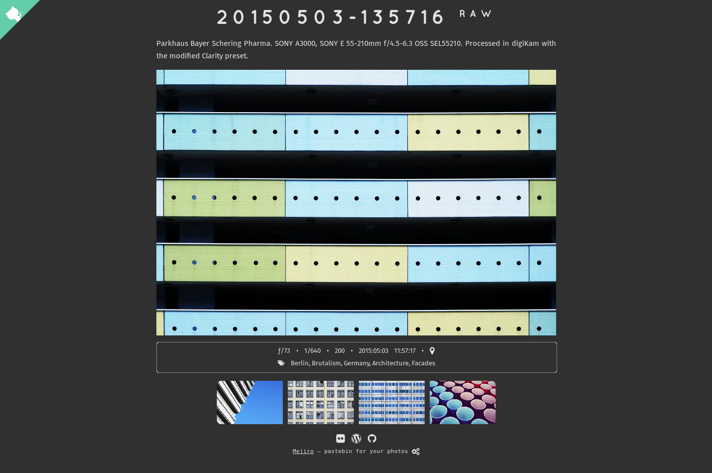

## About Mejiro

Mejiro is an easy-to-use PHP web app for instant photo publishing.

The [Linux Photography](https://gumroad.com/l/linux-photography) book provides detailed information on using Mejiro. Get your copy at [Google Play Store](https://play.google.com/store/books/details/Dmitri_Popov_Linux_Photography?id=cO70CwAAQBAJ) or [Gumroad](https://gumroad.com/l/linux-photography).

## Features

- **Simplicity** Mejiro requires no installation, and it can be deployed on any web server with PHP.
- **Instant and easy photo publishing** Upload photos, and Mejiro does the rest.
- **Responsive design** Mejiro works well on mobile devices.
- **Pagination** Mejiro automatically splits photo collection into pages. You can specify the desired number of photos per page.
- **Basic EXIF data** The app extracts and displays basic EXIF info for each photo, including aperture, shutter speed, and ISO.
- **Display geographical coordinates on OpenStreetMap or Google Maps** For geotagged photos, you can view their exact locations on OpenStreetMap.
- **Optional description text** You can add a description to each photo by creating an accompanying *.txt* file. The app can also read and display descriptions from the photo's *UserComment* EXIF field.
- **Automatic language detection** Mejiro automatically detects the browser language and picks the description text file with the appropriate language prefix.
- **Link to RAW** For each photo in the JPEG format, you can upload the accompanying RAW file, and Mejiro automatically adds a link to it. This feature can be disabled.
- **Password protection** Mejiro allows you to protect the published contents with a password. The application supports multiple passwords, so you can grant and revoke temporary access. Mejiro also makes it possible to exclude specific albums from being password-protected.
- **Support for subfolders** Photos inside the default photo directory can be organized into subfolders.
- **Access keys** The application supports access keys for common actions.

## Requirements

* A web server with PHP7 or higher (tested with Apache and lighttpd)
* PHP libraries: GD, EXIF
* Git (optional)

## Installation and usage

1. On Debian, Ubuntu, and Raspberry Pi, install Mejiro by running the following command as root: `curl -sSL https://raw.githubusercontent.com/dmpop/mejiro/main/install.sh | bash`. On other distributions, install the required packages and clone the project's Git repository using the command `git clone https://github.com/dmpop/mejiro.git` as root. Alternatively, you can download the ZIP archive and extract it into the document root of the server.
2. Open the *config.php* file in a text editor and edit settings.
3. Put photos into the *photos* directory (_.jpg_, _jpeg_, _.JPG_, and _.JPEG_ as well as RAW files).
4. Make the _mejiro_ directory writable by the server by running `chown www-data -R mejiro` as root.
5. Point the browser to _http://127.0.0.1/mejiro/_ (replace _127.0.0.1_ with the actual IP address or domain name of your server).

You can add descriptions to photos by creating accompanying _.txt_ files. For example, to add a description to the _F994362-R1-14-15.jpg_ photo, create the _F994362-R1-14-15.txt_ file containing a short text. You can use HTML markup for formatting the text. To add description files in other languages, use the appropriate language prefix as follows: _de-F994362-R1-14-15.txt_ (for German), _ja-F994362-R1-14-15.txt_ (for Japanese), etc.

## Run Mejiro in a container

1. Install [Podman](https://podman.io) and [Buildah](https://buildah.io).
2. Create a directory for your photos on the host machine.
3. Switch to the _mejiro_ directory and build an image using the `./buildah.sh` command.
4. Run a container on port 8000: `podman run -d --rm -p 8000:8000 -v /path/to/photos:/usr/src/mejiro/photos:rw mejiro` (replace _/path/to/photos_ with the actual path to the directory on the host containing photos).
5. Point the browser to _http://127.0.0.1:8000_ (replace _127.0.0.1_ with the actual IP address or domain name of the machine running the container).

## Author

Dmitri Popov ([dmpop@linux.com](mailto:dmpop@linux.com))

## License

Mejiro is released under the [GNU General Public License version 3](http://www.gnu.org/licenses/gpl-3.0.en.html) license.
