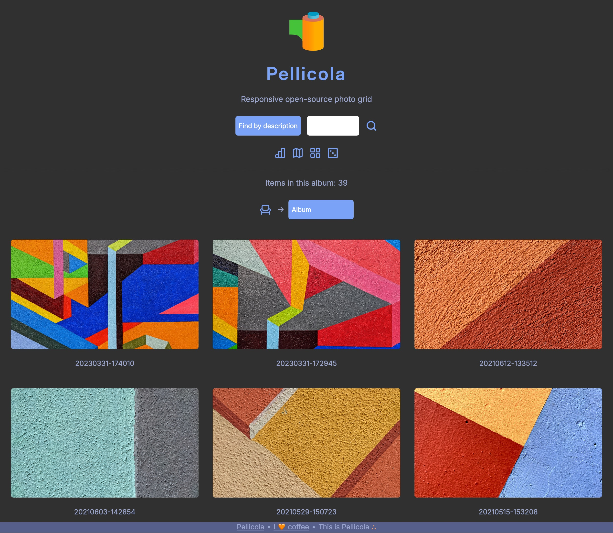

## About Pellicola

Pellicola is an easy-to-use PHP web app for instant photo publishing.



The [Pellicola manual](https://dmpop.gumroad.com/l/pellicola-manual) provides detailed information on installing and using Pellicola. Get your copy at [Gumroad](https://dmpop.gumroad.com/l/pellicola-manual).

## Features

- **Simplicity** Pellicola requires no installation, and it can be deployed on any web server with PHP.
- **Instant and easy photo publishing** Upload photos, and Pellicola does the rest.
- **Responsive design** Pellicola works well on mobile devices.
- **Pagination** Pellicola automatically splits photo collection into pages. You can specify the desired number of photos per page.
- **Search** Basic search functionality makes it possible to find photos by their file names and descriptions.
- **Basic EXIF data** The app extracts and displays basic EXIF info for each photo, including aperture, focal length, shutter speed, and ISO.
- **Show map** If the `$SHOW_MAP` option is enabled, Pellicola displays an embedded map marking the position of the currently viewed geotagged photo. This also enables a dedicated map that shows all photos in the current album.
- **OpenStreetMap links or Geo URIs** For geotagged photos, Pellicola displays either OpenStreetMap links or geo URIs that show the exact locations where the photos were taken either in OpenStreetMap or in the default map application.
- **Optional album description** If a _preamble.html_ file exists in the album's folder, Pellicola displays its contents as the album's description.
- **Optional photo description** You can add a description to each photo by creating an accompanying _.txt_ file. The app can also read and display descriptions from the photo's _UserComment_ EXIF field.
- **Automatic language detection** Pellicola automatically detects the browser language and picks the description text file with the appropriate language prefix.
- **Downloads** With the download option in the _config.php_ file enabled, visitors can download photos. Downloads are password protected by default. Password protection can be disabled by leaving `$DOWNLOAD_PASSWORD` in the _config.php_ file empty.
- **RAW downloads** For each photo in the JPEG format, you can upload the accompanying RAW file, and Pellicola automatically adds a download link to it when the download option is enabled.
- **Multiple albums** Subdirectories inside the default photo directory are rendered as individual albums.
- **Protected albums** Albums can be protected with a password.
- **Statistics** View basic statistics: camera models, focal length stats, the total number of photos and RAW files, disk usage, and the total number of downloads.
- **Random photo** feature. Can be used to display photos in a browser in full-screen mode.
- **Access keys** The application supports [access keys](https://developer.mozilla.org/en-US/docs/Web/HTML/Global_attributes/accesskey) for common actions.
- **Internationalization** support. Pellicola automatically detects and picks the right language. Localizing Pellicola is a matter of translating text strings in an appropriate _.ini_ file.
- **RSS feed** The application automatically generates an RSS feed with newly added photos.
- **Self-contained and GDPR-compliant** Pellicola has no external dependencies, and it doesn't collect any user data.

## Requirements

* A web server with PHP7 or higher (tested with Apache and lighttpd)
* PHP libraries: GD, EXIF
* Git (optional)

## Installation and usage

1. On Debian, Ubuntu, and Raspberry Pi, install Pellicola by running the following command as root: `curl -sSL https://raw.githubusercontent.com/dmpop/pellicola/main/install.sh | bash`. On other distributions, install the required packages and clone the project's Git repository using the command `git clone https://github.com/dmpop/pellicola.git` as root. Alternatively, you can download the ZIP archive and extract it into the document root of the server.
2. Open the *config.php* file in a text editor and edit settings.
3. Put photos into the *photos* directory (_.jpg_, _.jpeg_, _.JPG_, and _.JPEG_ as well as RAW files).
4. Make the _pellicola_ directory writable by the server by running `chown www-data -R pellicola` as root.
5. Point the browser to _http://127.0.0.1/pellicola/_ (replace _127.0.0.1_ with the actual IP address or domain name of your server).

### Important note about passwords

The `PASSWORD`, `$DELETE_PASSWORD`, and `$DOWNLOAD_PASSWORD` variables in _config.php_ are set to _secret_. To change them you have to create a hashed version of the desired passwords. To do this, you can use the following command (replace _secret_ with the desired password.)

```bash
php -r 'echo password_hash("secret", PASSWORD_DEFAULT);'
```

You can add descriptions to photos by creating accompanying _.txt_ files. For example, to add a description to the _F994362-R1-14-15.jpg_ photo, create the _F994362-R1-14-15.txt_ file containing a short text. You can use HTML markup for formatting the text. To add description files in other languages, use the appropriate language prefix as follows: _de-F994362-R1-14-15.txt_ (for German), _ja-F994362-R1-14-15.txt_ (for Japanese), etc.

## Run Pellicola in a container

Perform the following steps on the machine you want to use as a Pellicola server.

1. Install [Docker](https://docker.com).
2. Run the `hostname -I` command and note the IP address of the machine.
3. Create a directory for storing photos.
4. Clone the Pellicola Git repository using the `git clone https://github.com/dmpop/pellicola.git` command.
5. Switch to the resulting _pellicola_ directory, open the _config.php_ file for editing and replace the default value of the `base_url` to the IP address of the machine.
6. Become root using either `su` or `sudo su` command.
7. Build an image using the `docker build -t pellicola .` command.
4. Run a container: `docker run -d --rm -p 80:8000 --name=pellicola -v /path/to/photos:/usr/src/pellicola/photos:rw pellicola` (replace _/path/to/photos_ with the actual path to the created directory).
5. Point the browser to _http://127.0.0.1_ (replace _127.0.0.1_ with the actual IP address or domain name of the machine running the container).

### Deploy Pellicola with docker-compose.yml

Using the supplied _docker-compose.yml_ file, you can deploy Pellicola on a machine with a domain name assigned to it. This approach automatically enables HTTPS.

1. Open the _Caddyfile_ for editing.
2. Replace `<email address>` with the email address you want to use with the Let's Encrypt service.
3. Replace `<domain name>` with the domain name assigned to the server.
4. Save the changes.
5. Run the `docker compose -d`command.

## Author

Dmitri Popov ([dmpop@fastmail.com](mailto:dmpop@fastmail.com))

## Acknowledgments

- Icons: [Iconoir](https://iconoir.com/)
- Internationalization: [php-i18n](https://github.com/Philipp15b/php-i18n)

## License

Pellicola is released under the [GNU General Public License version 3](http://www.gnu.org/licenses/gpl-3.0.en.html) license.
