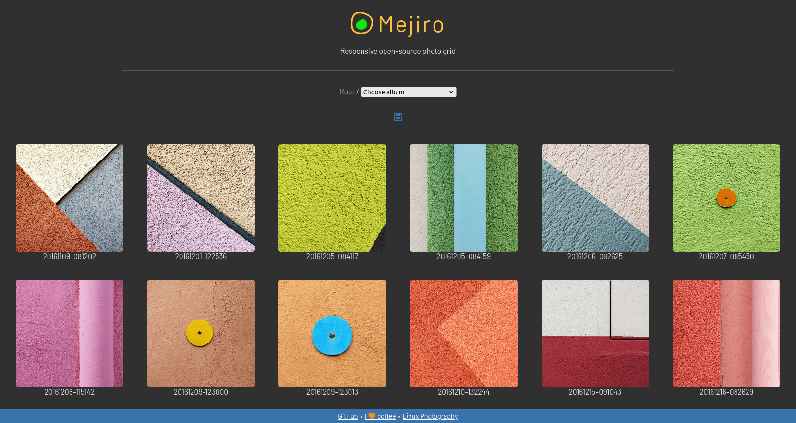

## About Mejiro

Mejiro is an easy-to-use single-file PHP web app for instant photo publishing.

## Features

- **Simplicity** The entire app consists of a single PHP file (plus a fav icon). Mejiro requires no installation, and it can be deployed on any web server with PHP5 and the GD library.
- **Responsive design** Mejiro works well on mobile devices.
- **Instant and easy photo publishing** Upload photos, and Mejiro does the rest.
- **Basic EXIF data** The app extracts and displays basic EXIF info for each photo, including aperture, shutter speed, and ISO.
- **Display geographical coordinates on OpenStreetMap or Google Maps** For geotagged photos, you can view their exact locations on OpenStreetMap.
- **Short URLs** Mejiro can use a URL shortening service of your choice (default is [is.gd](http://is.gd/)) to generate short URLs for easy sharing.
- **Optional description text** You can add a description to each photo by creating an accompanying *.txt* file. The app can also read and display descriptions from the photo's *UserComment* EXIF field.
- **Automatic language detection** Mejiro automatically detects the browser language and picks the description text file with the appropriate language prefix.
- **Link to RAW** For each photo in the JPEG format, you can upload the accompanying RAW file, and Mejiro automatically adds a link to it.
- **Support for subfolders** Photos inside the default photo directory can be organized into subfolders.
- **Keyboard shortcuts** The application supports keyboard shortcuts for common actions.

## Requirements

* A web server with PHP5 and the GD library. (Tested with Apache and lighttpd)
* cURL
* Git (optional)

## Installation and Usage

1. Install the required packages. On Debian and Ubuntu, this can be done by running the following command as root: `apt install apache2 php5 php5-gd curl git`
2. In the terminal, switch to the root directory of the server (e.g., */var/www/html*) and use the `git clone https://github.com/dmpop/mejiro.git` command as root to fetch the latest source code. Alternatively, you can download the ZIP archive and extract it into the document root of the server.
3. Open the *index.php* file in a text editor and edit settings. This step is optional.
4. Put photos into the *photos* directory (*.jpg*, *jpeg*, *.JPG*, and *.JPEG* as well as RAW files).
5. Make the *mejiro* directory writable by the server using the `chown www-data -R mejiro` command as root.
6. Point the browser to *http://127.0.0.1/mejiro/* (replace *127.0.0.1* with the actual IP address or domain name of your server).

You can add descriptions to photos by creating accompanying *.txt* files. For example, to add a description to the *F994362-R1-14-15.jpg* photo, create the *F994362-R1-14-15.txt* file containing a short text. You can use HTML markup for formatting the text. To add description files in other languages, use the appropriate language prefix as follows: *de-F994362-R1-14-15.txt* (for German), *ja-F994362-R1-14-15.txt* (for Japanese), etc.

## Author

Dmitri Popov ([dmpop@linux.com](mailto:dmpop@linux.com))

## License

Mejiro is released under the [GNU General Public License version 3](http://www.gnu.org/licenses/gpl-3.0.en.html) license.
